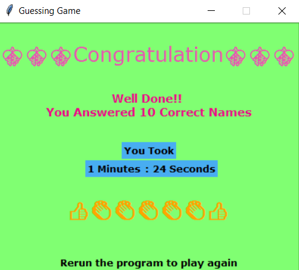

# Guessing-Game

This is a GUI based "Guessing Game" where you can guess name of 4 different fields : Animals, Birds, Flowers and Fishes.

# How to Play

First you will encounter a window where you have to select any one field,
Then you will have a jumbled word which you have to guess correct,
For each correct guess your score will get incremented by 1 and for wrong guess score will decremented by 1 respectively.
You are provided by a HINT button which allows you get 5 hints only.
To skip any word use NEXT button or spacebar and use OK button or Enter key to proceed.
After guessing 10 correct words you will have a new window where you can see what time you took to complete the game.

# GUI
First Window--

Second Window--

Download:
1) Copy the link given below.
2) On your terminal paste "git clone {link}"
3) # Link: https://github.com/AkhileshMattam/Guess-Me.git
